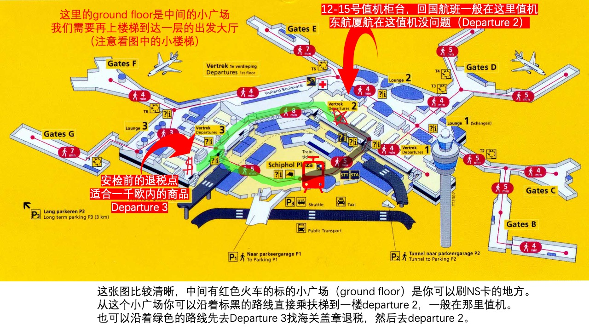

      

**MU772 阿姆斯特丹-上海 小攻略**

首先希望可以一切顺利。

## 一. 核酸检测和微信绿码：

首先应该密切注意荷兰大使馆官方主页的消息（一切以大使馆的声明为主）。

[关于更新健康码/健康状况声明书二维码受理要求的重要通知](http://nl.china-embassy.org/chn/xwdt/202109/t20210902_9017907.htm)

**这里摘录一些重点信息：**

 **1.  核酸 PCR+IgM 的费用总计为195欧，个人比较推荐以下两个机构：**

-   [Coronalab.eu](http://Coronalab.eu) 检测点比较多分布的城市也比较广泛，有的检测点甚至可以预约当天的检测。不过要注意选择预约 IgM Duo test China，而不是PCR & Serology test。
 
 
-   Novamedik Diagnostics （诺华美诊断）荷兰境内检测点，好处是可以提供中文服务：[https://www.coronaspeedtest.com/](https://www.coronaspeedtest.com/)

  

 **2. 从荷兰始发及从第三国始发、途经荷兰中转赴华旅客申请健康码的常规要求：**

   **从荷兰始发的赴华旅客申请健康码必须同时上传：**
-   1、我馆指定检测机构出具的**核酸、血清IgM抗体双检测证明**。（即第一项中的文件）你可以提前两天内去检测，比如你的航班是1月3日，你可以1号或者2号任何时间去检测，检测报告上不会出现检测的具体时间。
  

-   2、**机票行程单**。

  

-   3、有效的荷兰居留证明：中国公民上传在有效期内的**荷兰居留卡**或荷兰签证（确因特殊情况无法提交在有效期内的荷兰居留卡或荷兰签证的，可用出具日期为登机前28日以内的当地市政厅登记证明（uittreksel/afschrift）代替）。（现在有不同版本的居留卡）

  

-   4、完成接种满14天的新冠疫苗接种凭证（如有），包括荷兰GGD出具的 **Registratiekaart coronavaccinatie**、记录个人信息并经GGD盖章的Vaccinatieboek，以及各类国产新冠疫苗接种证明等。其中，完整接种新冠疫苗后核酸检测阴性而IgM抗体检测阳性的乘客申请健康码时还需如实填写**《新冠疫苗接种声明书》**（请见附件）并亲笔签名后上传。(最终没有用到《新冠疫苗接种声明书》但准备起来也不麻烦，大使馆网页上有附件可以下载)。

  
 **3. 通过微信防疫健康码国际版获得绿码**
- 首先可以通过长按识别下述二维码打开微信小程序进行申报：
 
 
 - 之后你可以通过点击申报上传你自己的上述文件，这里提供一个填报开头的截图（信息比较多，需要耐心的填写）：
 
 
 - 最终你会得到一个时效大约为48小时的绿色二维码 (记得截图保存，因为如果到了机场你需要出示这个绿码。如果网络不好就比较闹心，提前截图总可以在自己的相册里找到，也给手机省电)
 

- 等你拿到这个绿码，你就可以安心的睡觉了，就安心得等着你的航班吧。

**注意：**

-   做核酸检测的时候最好和工作人员确定一下自己做的核酸检测是不是包含IgM，有些检测即使取了血清如果做的的IgG抗体航班也是不认的。
-   需要把所有文文件存成**图片格式**（pdf不可以上传，可存为 **jpg 或 png**格式）然后存到手机上（或者电脑登录微信），打开微信防疫健康码国际版，进入后申报。
-   注意申报的时候上传的图片会出现失真的情况，建议把图片保存的清晰一点。
-   我听说新冠的检测会出现假阳性然后误机的例子。所以建议航班两天前去检测。检测完当天的晚上十一点前会出结果，如果出现假阳性还有转还的余地。
-   得到检测结果的当天晚上确认无误的话就可以申请绿码了，大使馆审核比较快，我的只花了不到一个小时就完成了。

## 二. 乘机流程

航班的当天你就可以携带你所有的行李去机场乘机了。这里需要特别注意的是由于现在机场的手续相对繁琐，人可能也比较多，建议提前比较多的时间去机场。我的航班在中午12: 40的，我八点半从乌特勒支出发都有点仓促。

**1. 机场示意图**

大家主要参考谷歌地图和[机场地图](https://www.schiphol.nl/en/airport-maps)，这里我分享几个机场平面图。
- 首先，如果大家乘坐NS的火车到达机场，火车下车到负一层，需要到ground floor刷出站的卡，这时候你在一个ground floor的小广场上。

- 接下来，你可以会出现在下图的红色火车附近，这是零层的小广场，然后你有两条路线可以走。如果想退税的话，可以走绿色的路线；如果不要的话直接走黑色的路线。

- 这里详细展示退税点附近的放大图和几张图片，如果还找不到的话可以问工作人员。

- 需要退税的小伙伴，这里会比较推荐安检前的海关退税点，这样展示完商品退完税你就可以把你带的商品托运了。

**2. 值机与安检**

接下来你需要进入到值机和安检的部分了。
首先来看一下东方航空有关于值机的说明

所以整个值机过程需要如图中显示的三步：

1. 先去 Departure 2 的航空公司的服务柜台（如图中圈1），有航班的当天一定有工作人员在场，这时候你需要向他们展示你的**护照**和微信中的**健康绿码**
2. 然后你需要排很长的队（比如黑色的线展示的路径）到柜台(如图中圈2）进行**值机**同时**托运行李**。
3. 值机过后一定要再次回到航空公司的服务台，工作人员需要**拍照留记录**，你才可以去安检。这里你可以沿着图中黄线所示的路径从值机柜台回到航空公司的服务台。

这时候你已经完成值机，得到登机牌了。接下来你需要通过安检去到机场免税店和候机的区域。

1. 机场的安检在值机柜台的楼上，你需要从后面的楼梯上到二楼。完成上一步航空公司最后的查验后你处在圈3的位置，这样你可以沿着彩线到后面通过**机票闸门**，然后**上楼**进行安检。
2. 由于疫情原因，安检相对比较松散，之后你就通过passport control出海关了。出了海关你可以继续沿着彩色的线下到一楼，这样一楼的区域就是**机场免税店**的区域。
3. 如果有时间的话可以逛逛机场免税店，之后你就可以按照机票上显示的登机口去寻找你的航班的**登机口**了，机场有相对清晰地标识。

**注意：**
- 如果你打算穿防护服的话，值机的时候就可以穿上了，我个人感觉的时候值机的人最多，全球各地的人都有，挤在一个小小的区域，非常危险。不过一定要注意安检的时候安检人员可能会要求你脱掉外套，如果你穿着防护服的话可能会比较麻烦一点。我个人是过了安检后才穿上的防护服，这时候穿上防护服主要是为了防止机上感染。（另外关于是不是要穿防护服的问题，我发现很多人都没有穿。这里有两个问题：穿防护服会不会很尴尬？穿上会不会很不方便？首先大家都不认识，我觉得没有什么尴尬的。另外防护服对女生不太友好，就像连体裤一样，男生可以穿着防护服小便，女生得脱掉。同时拿口袋里的东西稍微有点不方便，但也没有特别不方便。）

**3. 海关旅客指尖服务**
另外除了前面提到的防疫健康码国际版，另外一个非常重要的二维码是海关旅客指尖服务

这个后面飞机上的空乘人员会检查，另外入关的时候之前的健康码不需要了，只需要**海关指尖服务的二维码**。你需要申报过去14天的旅行记录，填写完了是如下黄色的码：

几件值得注意：
- 海关指尖服务最好是**当天**（一定要当天，因为你需要向前计算14天）趁着有荷兰的网络的时候提前填写一下，因为上了飞机等空乘检查的时候再填就有点晚了。另外，在飞机起飞前一定要保证自己的手机能连接移动数据网络，如果需要继续修改或者填写二维码相关的信息时没有网络就会非常抓狂。
- 另外，一定要保证到了国内一下飞机能够连接上手机的移动数据，也就是说你的国内手机卡要有流量。因为后续会用网络填写很多信息，要不然你就只能到处可怜巴巴的借别人的热点了。
- 流量的问题每个码都提前截图不能完全解决。如果之前填错了需要修改，到了选酒店前我们在上海还扫过别的码，生成了一个别的二维码（这个码应该只是上海的）：

## 飞机上的旅程

如果前面的一切顺利，很快你就可以登上飞机了。飞机上一般都是隔一个人一个座，我的座是值机的工作人员帮我选的。飞机上的旅程和正常情况并没有什么区别，这里只有几个小小的提醒注意：
- 飞机上提供了两餐的食物，已经都放到座位上了，其中都是一些小饼干小面包之类，比较容易进食，但是会引起胃胀的问题。我当时肚子一直乱叫，真的希望有健胃消食片呀。另外飞机中提供了四五瓶纯净水，喝的时候一定要缓慢一点，以滋润一下自己为目标，不然太容易上厕所会很不方便。
- 最好准备一个小小的手包，可以是一个小塑料自封袋放在手边。这个自封袋中可以装一点糖果(机餐中包含类似士力架的食物)，口罩，消毒湿巾纸，塑胶手套等。
- 我猜是为了防止耳机交叉感染，飞机上的娱乐系统不能工作，只显示地图。所以提醒最好是自带一套娱乐系统来消磨时间。
- 机上的空乘人员会量几次体温，落地的时候也会有地面防疫的人上来检查，还是比较严格的。

## 落地之后

这里只能大体讲一下上海这边从机场到隔离酒店的流程。我大约八点左右到的上海，到达酒店的时候大约十一点半，其实总的时间还算可以。我在去酒店的大巴上睡着了，所以不太清楚大巴上行驶了多久，不过酒店距离机场应该不近。

- 首先，在上海一下飞机我们需要向地面防疫人员展示之前海关指尖服务的二维码，填写入境检疫知情书，检疫登记和领取检疫的试管。
- 之后大家就会排着队去检疫的地方进行喉咙和鼻子的PCR检测。不同的人对检测有不同的反应，我的感受是比荷兰检测人员的手法强悍很多，我干呕了好几次。基本上检测的地方干呕声和呼喊声此起彼伏。
- 检测完了之后就是入关，海关工作人员会问大家隔离完去哪里，手机号是什么等等，然后面部识别完你就算入关了。
- 入了关可以提取行李，如果你没有申报的行李物品你就可以走无申报通道到出口处理酒店入住的事情了。
- 如果有行李被海关检查，走申报通道可以帮你不用交税通关，如下图（具体怎么操作可以找其他攻略，我有机会也可以详细解释）

- 入关之后，上海的情况是分成三类进行隔离：上海本地隔离政策，苏浙皖等地3+11，其他各省14天隔离。其他各省隔离期间应该可以继续选择在上海+7，这个后续再了解一下。

## 酒店隔离生活

在工作人员"悉心呵护"下，我们终于开始了隔离生活了。我们一部分人来到了上海崇明万信惠选酒店隔离点，隔离的价格是350元/天，14天合计4900元。酒店可以点除了酒店提供的食物外的外卖，也可以收快递。防疫工作人员每天来测两次体温，送三次饭。另外酒店卫生用品是提前准备好的，有两包抽纸，三双一次性拖鞋，一桶泡面，14瓶矿泉水，厕纸等等。
接下来是几张酒店隔离的照片：
早餐有包子，稀饭，豆浆和咸菜

午饭有两荤两素，另外有一个水果

晚饭也是两荤两素，另外有一杯小酸奶

酒店内部比较简陋，消毒液也腐蚀了一些家具

**几点特别提醒：**

1. 一双普通的拖鞋是很需要的。在室内行走，洗澡等等都离不来拖鞋。拖鞋大大的提高了生活的便利性。
2. 你同时要考虑隔离14天之后打包的问题，所以你从荷兰出发打包的工具类(比如胶带)可能在离开隔离点的时候也会需要。
3. 建议带上一块肥皂，可以用来洗内衣和袜子。这十四天免不了手洗一些衣物，我这家酒店没有提供洗衣粉或其他物品。所以我很庆幸自己带了一块肥皂。
4. 行李物品上防疫人员会用非常浓的消毒液进行消毒，所以要小心一点。我拿到行李进到宾馆的时候手烧的火辣辣的疼，仔细一看都白了。肯定是不小心碰到了浓消毒液腐蚀到了皮肤，不过所幸并不严重。
5. 其他的提醒想到了再添加吧。我本人是不太抱怨当下处境的人，可能也想不到更多提高隔离生活品质的好方法。所以大家可以自己想办法提高生活品质。

## 写在最后

希望大家都能顺利回家！也希望我的隔离生活尽快结束，回归自由。

